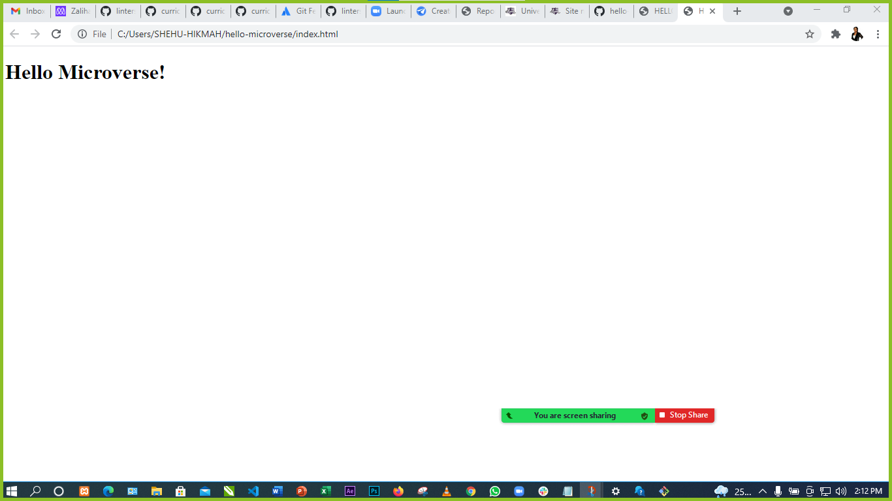

# MICROVERSE PROJECT 1



html and css is used for this project, it is about welcoming new students to microverse activities html stands for Hyper text mark-up language and Css stands for Cascading style sheet and it is used for styling a Webpage

## Built With

- Major languages
- html
- css


**This is an example of how you may give instructions on setting up your project locally.**
```
Login to your Git hub account and access the repository by clicking the link provided to download the repository: https://github.com/xaleehrtyunus
```
To get a local copy up and running follow these simple example steps.

### Prerequisites

### Setup

### Install

### Usage

### Run tests

### Deployment


## Authors

👤 **Zaliha Gambo Yunusa**

- GitHub: [@githubhandle](https://github.com/xaleehrtyunus)

## 🤝 Contributing

Contributions, issues, and feature requests are welcome!

Feel free to check the [issues page](../../issues/).

## Show your support

Give a ⭐️ if you like this project!

## Acknowledgments

- Hat tip to anyone whose code was used
- Inspiration
- etc

## 📝 License

This project is [MIT](./MIT.md) licensed.
